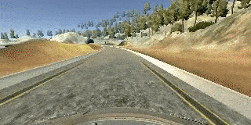

# Behavioral Cloning Project for Self-Driving Cars
Self-Driving Car Engineer Nanodegree Program


---
## Project Details

This repository contains the project files for the Behavioral Cloning Project in the Udacity Self-Driving Car Engineer Nanodegree.

In this project, a Convolutional Neural Network (CNN) is designed and trained in order to control a car in simulation. The goal is to record data from a human driver and use the data to train a CNN, which can control the car in a feasible way, hence cloning driving behavior.

The trained neural network is considered successful when it is able to drive the car one full round the track in the given Unity simulation environment.

Different models are trained, validated and tested using Keras and TensorFlow as backend. The models output a steering angle to the self-driving car in the simulation.

In the simulator the car is manually steered around a track for data collection. The image data and steering angles are used for training a neural network and then use this model to drive the car autonomously around the track.



---
## Implementation Details

A detailed report about the implementation can be found in [REPORT.md](REPORT.md)

Below you will find a summary of the essential details about the repository, files, installation and requried dependencies. The project contains various files essential to the training and validation of the Convolutional Neural Network:

* `model.py`: script used to create and train the model
* `drive.py`: script to drive the car with the trained model
* `models/model_nvidia_final.h5`: trained Keras model based on the Nvidia self-driving car CNN architecture
* `video.mp4`: video of the car driving autonomously around the track for one full round
* `Additional videos`
    * https://youtu.be/sJuIhd6ixHE
    * https://youtu.be/MWMzn8NZRW8

---
## Simulation Details
This project involves the Term 1 Simulator, which can be downloaded [here](https://github.com/udacity/self-driving-car-sim). The simulator provides measurement data from a three forward facing cameras outputting RGB images of 320x160 px, as well as the steering angle and velocity of the car.

---
## Installation and Setup

### Dependencies
The following dependencies are required in order to run the training.

* `TensorFlow`
* `Keras`
* `Additional Python packages`
    * eventlet Flask h5py imageio Keras matplotlib numpy pandas scikit-image scikit-learn scipy seaborn tornado

Installing additional dependencies

```sh
$ pip install eventlet Flask h5py imageio Keras matplotlib numpy pandas scikit-image scikit-learn scipy seaborn tornado pydot graphviz
```

### Singularity image
A Singularity defintion file is provided: [singularity/singularity.def](singularity/singularity.def)

The Singularity image was used for training the model on an [Nvidia DGX-2](https://www.nvidia.com/en-us/data-center/dgx-2/).

<!-- ---
## Creating a Great Writeup

A great writeup should include the [rubric points](https://review.udacity.com/#!/rubrics/432/view) as well as your description of how you addressed each point.  You should include a detailed description of the code used (with line-number references and code snippets where necessary), and links to other supporting documents or external references.  You should include images in your writeup to demonstrate how your code works with examples.

All that said, please be concise!  We're not looking for you to write a book here, just a brief description of how you passed each rubric point, and references to the relevant code :).

You're not required to use markdown for your writeup.  If you use another method please just submit a pdf of your writeup.
 -->

---
## Known Issues

### Simulator in macOS Catalina
If you get and error when launching the simulator for macOS Catalina, you may have to chance permission for the simulatior. In a terminal run the following command in the folder where your simulator is located.

```sh
$ chmod a+x term1_sim.app/Contents/MacOS/*
```

---
## Author
Simon Bøgh
