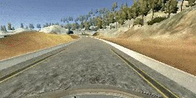
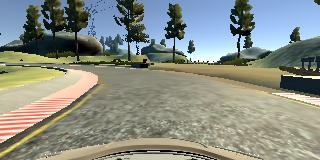

# Behavioral Cloning for a Self-Driving Car

The goals of this project are the following:
* Use the car simulator to collect data of good driving behavior
* Build, a Convolution Neural Network in Keras that predicts steering angles from images
* Train and validate the model with a training and validation set
* Test that the model successfully drives the car around the track one full round without leaving the road
* Summarize the results with a written report




[//]: # (Image References)

[image1]: ./examples/placeholder.png "Model Visualization"
[image2]: ./examples/placeholder.png "Grayscaling"
[image3]: ./examples/placeholder_small.png "Recovery Image"
[image4]: ./examples/placeholder_small.png "Recovery Image"
[image5]: ./examples/placeholder_small.png "Recovery Image"
[image6]: ./examples/placeholder_small.png "Normal Image"
[image7]: ./examples/placeholder_small.png "Flipped Image"


---
## Project Files and Code Details

### Files to run the simulator in autonomous mode

The project includes the following files:
* `model.py`: script used to create and train the model
* `drive.py`: script to drive the car with the trained model
* `cnn_models.py`: contains CNN architectures for Nvidia and LeNet
* `models/model_nvidia_final.h5`: trained Keras model based on the Nvidia self-driving car CNN architecture
* `models/model_lenet.h5`: trained Keras model based on the LeNet CNN architecture
* `video.mp4`: video of the car driving autonomously around the track for one full round
* `Additional videos`
    * https://youtu.be/sJuIhd6ixHE
    * https://youtu.be/MWMzn8NZRW8

### Code Details
Using the Udacity provided simulator and `drive.py` file, the car can be driven autonomously around the track by executing
```sh
$ python drive.py models/model_nvidia_final.h5
```

### Training and Saving a Model
The `model.py` file contains the code for training and saving the Convolution Neural Network. The file shows the pipeline I used for training and validating the model, and it contains comments to explain how the code works.

---
## Model Architecture and Training Strategy
### Model Architecture

Two CNN architectures have been tested:
* Nvidia self-driving car neural network
* LeNet

The Nvidia architecture was used for the final solution. The architecture can be seen in the figure below.


Initially, the input images are cropped to remove the top and bottom of the images. These regions are dominated by sky, trees and the hood of the car, and as such are not relevant for the learning how to drive. It was actually seen that the model performed much better by removing these regions. 50 pixels were removed from the top, and 20 pixels from the bottom (`models.py` line 78).

My model consists of a Convolution Neural Network with 3x3 and 5x5 filter sizes and depths between 36 and 64 (`cnn_models.py` lines 18-24)

The model includes RELU layers to introduce nonlinearity (`cnn_models.py` line 66, 69, 72, 75, and 77), and the data is normalized in the model using a Keras lambda layer (`cnn_models.py` line 64).

Finally, the model has 3 fully-connected layers of size 100, 50, and 10 (`cnn_models.py` lines 81-85).

The model outputs 1 value - the steering angle. Softmax is not used, as we want the raw value (logit), and not a probability

### Reducing Overfitting

The model does not contain any dropout layers, but instead max pooling in order to reduce overfitting (`cnn_models.py` line 67, 70, and 73). Max pooling reduces the number of parameters by reducing the spatial size of the representation.

The model was trained and validated on different data sets with a split of 80%/20% to ensure that the model was not overfitting. The model was tested by running it through the simulator and ensuring that the vehicle could stay on the track as can be seen in the following videos:
* https://youtu.be/sJuIhd6ixHE
* https://youtu.be/MWMzn8NZRW8

### Model Parameter Tuning with ADAM Optimizer

The model used an Adam optimizer, so the learning rate was not tuned manually (`model.py` line 82). The Adam optimizer is an extension to stochaastic gradient descent (SGD). Adam stands for `adaptive moment estimation`. Adam combines the advantages of two other optimizers; `AdaGrad` and `RMSProp`.

### Appropriate training data

Training data was chosen to keep the vehicle driving on the road. I used a combination of center lane driving, recovering from the left and right sides of the road.

For details about the training data, see the next section.

---
## Model Architecture and Training Strategy

### Solution Design Approach

The overall strategy for deriving a model architecture was to implement two well-known and popular models; LeNet-5 and Nvidia self-driving car architecture.

My first step was to use a Convolution Neural Network model similar to the LeNet-5. The model was a good starting point and initial training with smaller datasets showed the model was learning relevant drivining behavior. The driving behavior was not optimal though, so additional data was gathered.

In order to gauge how well the model was working, I split my image and steering angle data into a training and validation set with a 80%/20% split. I found that my first model had a relatively high mean squared error on the training set, which could imply that the model was underfitting, hence a more complex model was implemented and additional data was recorded as well.

Then I implemented the Nvidia self-driving car architecture, which has more convolutional layers and much higher amount of filters in each conv. layer. This provided more parameters and a more complex and rich model. The training and validation loss converged towards the same low value, and the model was hereafter tested in the simulator.

The final step was to run the simulator to see how well the car was driving around track one. There were a few spots where the vehicle fell off the track, especially in areas with left turns and brown dirt on the right side of the track. To improve the driving behavior in these cases, I recorded additional data where the car was moved to the edge of the road, then the recording was started and the car was driven towards the center of the road again. This significantly improved the behavior of the car and at the end of the process, the vehicle is able to drive autonomously around the track without leaving the road.


### Final Model Architecture

The final model architecture (`cnn_model.py` lines 49-89) consisted of a convolution neural network with the following layers and layer sizes as visualized below. The figure visualizes the Nvidia self-driving car architecture.


#### 3. Creation of the Training Set & Training Process

To capture good driving behavior, I first recorded one lap on track one using center lane driving. Here is an example image of center lane driving:





I then recorded the vehicle recovering from the left side and right sides of the road back to center so that the vehicle would learn to .... These images show what a recovery looks like starting from ... :


To augment the data sat, I also flipped the images essentially doubling my dataset, while at the same time reducing the bais of only turning left. After the collection process, I had 14.997 number of data points from center, left and right cameras combined, times two for flipped images. For the training however, only the center images were used, as this was found to be sufficient. End the end a total of 2x 4.999 = 9.998 images were used for training and validation.

The data was preprocessed by cropping the top and bottom of the images.

I finally randomly shuffled the data set (`model.py` line 73) using `sklearn.utils` and put 20% of the data into a validation set.

I used this training data for training the model. The validation set helped determine if the model was over or under fitting. The ideal number of epochs was 3-5, but a training session of 50 epochs was also tried to see the evolution of the loss, which can be seen in the following graph. After 10 epochs there is not much more to gain from the current dataset and the model starts to overfit a bit.


---
## Author

Simon Bøgh